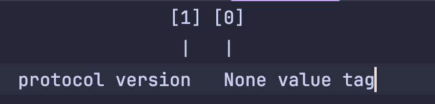
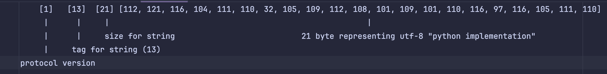
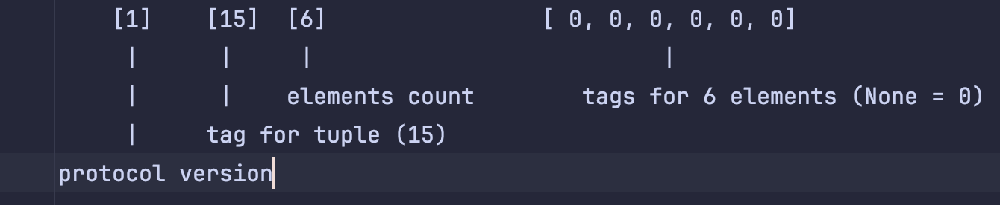

# Peace Data Protocol Specification. Version 1

**Peace Data Protocol (PDProto)** is a binary serialization protocol designed for all major native Python types. Engineered with a primary focus on execution speed and minimal footprint, it guarantees the following core principles:

1. **Reliability:** If the serialized payload remains pristine and unmodified, the object is guaranteed to deserialize without errors. Furthermore, the unpacked object will satisfy strict equality (==) with the original Python object.
2. **Backward Compatibility:** Any newer version of the protocol decoder is guaranteed to successfully deserialize payloads packed by older versions.
3. **Stability:** Type tag values are immutable. Tags will never be reassigned, altered, or deprecated in future protocol iterations.
4. **Ordering:** The sequence of elements within ordered collections (such as list or tuple) strictly mirrors the original object. For set objects, ordering is non-deterministic, aligning with native Python behavior.
5. **Efficiency:** Serialized binary payloads consistently yield a smaller byte footprint compared to identical datasets processed via native pickle or json.

---

## Layout

Every serialized payload starts with a **1-byte protocol version header**. If the incoming payload version exceeds the maximum version supported by the decoder, the parser must abort immediately and raise a human-readable error. No deserialization attempts should be made under these conditions.

The protocol enforces **packed binary alignment (no padding)** and utilizes **Big-Endian** byte ordering exclusively for encoding standard float primitives.

Data fields are laid out sequentially, directly following the version byte. Each data element begins with a **Type Tag** that defines its type, and optionally encodes its value or length.

### Length Encoding (Varint)
To minimize payload size, all integers and lengths of dynamic collections (such as bytes and str) are encoded using **Variable-length integers (Varints)**. 

This encoding utilizes the Most Significant Bit (MSB) as a continuation flag, using base-128 format (7 bits per byte for actual data). For more technical details on how Varint / LEB128 works, refer to:
- [Wikipedia: Variable-length integer](https://wikipedia.org)

### Data Compression (Used for strings only)
Payload compression is implemented using the **DEFLATE** algorithm (RFC 1951) wrapped in the **Zlib data format** (RFC 1950) with an **Adler-32** checksum.

- **Python implementation**: zlib.compress() / zlib.decompress()
- **Rust implementation**: flate2::write::ZlibEncoder / flate2::read::ZlibDecoder

---

## Data Representation

### Fixed-Size Primitives
Objects devoid of intrinsic length (such as None or False) are represented solely by their 1-byte type tag.

*Example: Complete byte representation of None in Protocol Version 1:* [1, 0]

### Variable-Length Primitives
Objects possessing dynamic length (such as str) contain an explicit length descriptor followed by the raw data payload.

*Example: Complete byte representation of the string "python implementation" in Protocol Version 1:* 
[1, 13, 21, 112, 121, 116, 104, 111, 110, 32, 105, 109, 112, 108, 101, 109, 101, 110, 116, 97, 116, 105, 111, 110]

### Dynamic Collections
Non-empty collections (such as tuple) encode the total **element count** (not the raw byte size), followed by the sequential layout of their elements.

*Example: Complete byte representation of a 6-element tuple (None, None, None, None, None, None) in Protocol Version 1:* [1, 15, 6, 0, 0, 0, 0, 0, 0]

### Optimized Inline Tags
"Optimizing" tags are dedicated markers that inherently imply the exact layout or dimension of a structure, eliminating the need to write separate size descriptors. For instance, the TUPLE_2 tag [56] pre-defines a tuple containing exactly 2 elements; the parser expects the elements immediately after the tag without parsing a length descriptor.

*Example: Complete byte representation of an optimized tuple (None, None) in Protocol Version 1:* [1, 56, 0, 0]

---

## Tags for Types

The protocol natively processes standard built-in Python types exclusively:
`None` | `bool` | `int` | `float` | `str` | `bytes` | `list` | `tuple` | `dict` | `set` | `datetime`

Nested collections may only encapsulate the aforementioned types.

Note: An asterisk * indicates a variable size dependent on the payload (e.g., string length)

| Python Type / Value                   | Tag (Decimal) | Size (Bytes) | Notes                                                                                                            |
|:--------------------------------------|:-------------:|:------------:|:-----------------------------------------------------------------------------------------------------------------|
| `None`                                |      `0`      |      1       |                                                                                                                  |
| `True`                                |      `1`      |      1       |                                                                                                                  |
| `False`                               |      `2`      |      1       |                                                                                                                  |
| `0.0` (float)                         |      `3`      |      1       | Represents float 0.0                                                                                             |
| `""` (string)                         |      `4`      |      1       | Represents empty string                                                                                          |
| `[]` (list)                           |      `5`      |      1       | Represents empty list                                                                                            |
| `tuple()` (tuple)                     |      `6`      |      1       | Represents empty tuple                                                                                           |
| `set()` (set)                         |      `7`      |      1       | Represents empty set                                                                                             |
| `{}` (dict)                           |      `8`      |      1       | Represents empty dict                                                                                            |
| `0` (int)                             |      `9`      |      1       | Represents integer 0                                                                                             |
| positive integer                      |     `10`      |     1-8      | Represents positive integer (>0), limited by u64 type in Rust (18_446_744_073_709_551_615)                       |
| negative integer                      |     `11`      |     1-8      | Represents negative integer (<0), limited by u64 type in Rust (18_446_744_073_709_551_615) with -                |
| float                                 |     `12`      |      8       | Represents float                                                                                                 |
| string                                |     `13`      |     2-*      | Represents non-empty string, always use UTF-8 encoding                                                           |
| list                                  |     `14`      |     3-*      | Represents non-empty list                                                                                        |
| tuple                                 |     `15`      |     3-*      | Represents non-empty tuple                                                                                       |
| set                                   |     `16`      |     3-*      | Represents non-empty set                                                                                         |
| dict                                  |     `17`      |     4-*      | Represents non-empty dict                                                                                        |
| b'' (bytes)                           |     `18`      |      1       | Represents empty bytes b''                                                                                       |
| bytes                                 |     `19`      |     3-*      | Represents bytes in any encoding                                                                                 |
| float without decimal places          |     `20`      |     2-8      | Represents positive float like 12.0, 1.0 etc.                                                                    |
| float with 1 decimal place            |     `21`      |     2-8      | Represents positive float like 12.1, 1.3 etc.                                                                    |
| float with 2 decimal places           |     `22`      |     2-8      | Represents positive float like 12.22, 3.14 etc.                                                                  |
| float with 3 decimal places           |     `23`      |     3-8      | Represents positive float like 12.123, 1.123 etc.                                                                |
| float with 4 decimal places           |     `24`      |     3-8      | Represents positive float like 12.1234 etc.                                                                      |
| float with 5 decimal places           |     `25`      |     4-8      | Represents positive float like 12.12345 etc.                                                                     |
| float with 6 decimal places           |     `26`      |     4-8      | Represents positive float like 12.123456 etc.                                                                    |
| datetime without timezone             |     `27`      |      10      | Represents naive datetime, without timezone, e.g. `datetime(2026, 9, 8, 21, 12, 0,)`                             |
| datetime with offset                  |     `28`      |    11-14     | Represents datetime, with timezone and hours offset, e.g. `datetime(2026, 9, 8, 21, 12, 0, tzinfo=timezone.utc)` |
| datetime with IANA zone               |     `29`      |    13-44     | Represents datetime, with timezone and hours offset, e.g. `datetime.now(tz=ZoneInfo("Europe/London")`            |
| negative float without decimal places |     `30`      |     2-8      | Represents negative float like -12.0, -1.0 etc.                                                                  |
| negative float with 1 decimal place   |     `31`      |     2-8      | Represents negative float like -12.1, -1.3 etc.                                                                  |
| negative float with 2 decimal places  |     `32`      |     2-8      | Represents negative float like -12.22, -3.14 etc.                                                                |
| negative float with 3 decimal places  |     `33`      |     3-8      | Represents negative float like -12.123, -1.123 etc.                                                              |
| negative float with 4 decimal places  |     `34`      |     3-8      | Represents negative float like -12.1234 etc.                                                                     |
| negative float with 5 decimal places  |     `35`      |     4-8      | Represents negative float like -12.12345 etc.                                                                    |
| negative float with 6 decimal places  |     `36`      |     4-8      | Represents negative float like -12.123456 etc.                                                                   |
| compressed string                     |     `40`      |     3-*      | Represents non-empty sting, compressed with **deflate** algorythm                                                |
| string with 1-byte length             |     `41`      |      2       | Represents string with exactly 1 byte length, always UTF-8 encoding, e.g. "a"                                    |
| string with 2-byte length             |     `42`      |      3       | Represents string with exactly 2 byte length, always UTF-8 encoding, e.g. "ab"                                   |
| string with 3-byte length             |     `43`      |      4       | Represents string with exactly 3 byte length, always UTF-8 encoding, e.g. "abc"                                  |
| string with 4-byte length             |     `44`      |      5       | Represents string with exactly 4 byte length, always UTF-8 encoding, e.g. "abcd"                                 |
| string with 5-byte length             |     `45`      |      6       | Represents string with exactly 5 byte length, always UTF-8 encoding, e.g. "abcde"                                |
| string with 6-byte length             |     `46`      |      7       | Represents string with exactly 6 byte length, always UTF-8 encoding                                              |
| string with 7-byte length             |     `47`      |      8       | Represents string with exactly 7 byte length, always UTF-8 encoding                                              |
| string with 8-byte length             |     `48`      |      9       | Represents string with exactly 8 byte length, always UTF-8 encoding                                              |
| string with 9-byte length             |     `49`      |      10      | Represents string with exactly 9 byte length, always UTF-8 encoding                                              |
| string with 10-byte length            |     `50`      |      11      | Represents string with exactly 10 byte length, always UTF-8 encoding                                             |
| string with 11-byte length            |     `51`      |      12      | Represents string with exactly 11 byte length, always UTF-8 encoding                                             |
| string with 12-byte length            |     `52`      |      13      | Represents string with exactly 12 byte length, always UTF-8 encoding                                             |
| string with 13-byte length            |     `53`      |      14      | Represents string with exactly 13 byte length, always UTF-8 encoding                                             |
| string with 14-byte length            |     `54`      |      15      | Represents string with exactly 14 byte length, always UTF-8 encoding                                             |
| string with 15-byte length            |     `55`      |      16      | Represents string with exactly 15 byte length, always UTF-8 encoding                                             |
| tuple with 2 elements                 |     `56`      |     3-*      | Represents tuple with exactly 2 any elements, e.g. (1, 2)                                                        |
| tuple with 3 elements                 |     `57`      |     4-*      | Represents tuple with exactly 3 any elements, e.g. (1, 2, 3)                                                     |
| tuple with 4 elements                 |     `58`      |     5-*      | Represents tuple with exactly 4 any elements, e.g. (1, 2, 3, 4)                                                  |
| tuple with 5 elements                 |     `59`      |     6-*      | Represents tuple with exactly 5 any elements, e.g. (1, 2, 3, 4, 5)                                               |
| 1000 (int)                            |     `60`      |      1       | Exact int value 1000 (commonly used)                                                                             |
| 1 (int)                               |     `61`      |      1       | Exact int value 1 (commonly used)                                                                                |
| 2 (int)                               |     `62`      |      1       | Exact int value 2 (commonly used)                                                                                |
| 3 (int)                               |     `63`      |      1       | Exact int value 3 (commonly used)                                                                                |
| 4 (int)                               |     `64`      |      1       | Exact int value 4 (commonly used)                                                                                |
| 5 (int)                               |     `65`      |      1       | Exact int value 5 (commonly used)                                                                                |
| 6 (int)                               |     `66`      |      1       | Exact int value 6 (commonly used)                                                                                |
| 7 (int)                               |     `67`      |      1       | Exact int value 7 (commonly used)                                                                                |
| 8 (int)                               |     `68`      |      1       | Exact int value 8 (commonly used)                                                                                |
| 9 (int)                               |     `69`      |      1       | Exact int value 9 (commonly used)                                                                                |
| 10 (int)                              |     `70`      |      1       | Exact int value 10 (commonly used)                                                                               |
| 11 (int)                              |     `71`      |      1       | Exact int value 11 (commonly used)                                                                               |
| 12 (int)                              |     `72`      |      1       | Exact int value 12 (commonly used)                                                                               |
| 13 (int)                              |     `73`      |      1       | Exact int value 13 (commonly used)                                                                               |
| 15 (int)                              |     `74`      |      1       | Exact int value 15 (commonly used)                                                                               |
| 20 (int)                              |     `75`      |      1       | Exact int value 20 (commonly used)                                                                               |
| 24 (int)                              |     `76`      |      1       | Exact int value 24 (commonly used)                                                                               |
| 50 (int)                              |     `77`      |      1       | Exact int value 50 (commonly used)                                                                               |
| 100 (int)                             |     `78`      |      1       | Exact int value 100 (commonly used)                                                                              |
| list with 1 element                   |     `81`      |     2-*      | Represents list with exactly 1 element, e.g. `[1,]`                                                              |                                                                              |
| list with 2 elements                  |     `82`      |     3-*      | Represents list with exactly 2 elements, e.g. `[1, 2]`                                                           |                                                                              |
| list with 3 elements                  |     `83`      |     4-*      | Represents list with exactly 3 elements, e.g. `[1, 2, 3]`                                                        |                                                                              |
| list with 4 elements                  |     `84`      |     5-*      | Represents list with exactly 4 elements                                                                          |                                                                              |
| list with 5 elements                  |     `85`      |     6-*      | Represents list with exactly 5 elements                                                                          |                                                                              |
| list with 6 elements                  |     `86`      |     7-*      | Represents list with exactly 6 elements                                                                          |                                                                              |
| list with 7 elements                  |     `87`      |     8-*      | Represents list with exactly 7 elements                                                                          |                                                                              |
| list with 8 elements                  |     `88`      |     9-*      | Represents list with exactly 8 elements                                                                          |                                                                              |
| list with 9 elements                  |     `89`      |     10-*     | Represents list with exactly 9 elements                                                                          |                                                                              |
| list with 10 elements                 |     `90`      |     11-*     | Represents list with exactly 10 elements                                                                         |                                                                              |

## Type-Specific Features and Optimizations

### Integer

Unlike Python's arbitrary-precision integers, primitives within this protocol are bounded by Rust's u64::MAX value (18_446_744_073_709_551_615). 
Negative integers are converted to positive numbers by stripping the minus sign and are prefixed with a dedicated tag 11, inheriting the same threshold. 
Integers are serialized via the Varint algorithm described above; the storage delta becomes apparent for values greater than 127. 

Highly recurrent integer constants (0, 1-13, 15, 20, 24, 50, 100, 1000) bypass Varint processing and map directly to dedicated standalone tags.

### Float

Standard float primitives are serialized as an 8-byte Big-Endian sequence, excluding 0.0 and optimized decimal structures. 
Special IEEE 754 values such as Inf, -Inf, and NaN are fully supported. Float optimization scales down the 8-byte overhead based on decimal precision, targeting values with up to 6 decimal places. 
The optimization routine evaluates the following logic:
 - The value must map cleanly to an optimization-eligible precision tier (1 to 6 decimal places).
 - The value at n decimal places must reside below an upper bound threshold, defined as 268_435_455.0 divided by 10^n.
 - The float is multiplied by 10^n to truncate decimal components, converting it into a standard integer.
 - The encoder writes the corresponding tag (e.g., FLOAT_6 26) followed by the derived integer payload via Varint.

During deserialization, the operation is reversed: the parser infers the scaling exponent n from the tag, reads the Varint integer, and divides it by 10^n to recreate the precise float primitive. 

If the optimization path yields a size greater than or equal to 6 bytes, the encoder falls back to standard 8-byte serialization to prioritize processing throughput.

### String

Strings are strictly bound to UTF-8 or compatible ASCII byte streams. If a string utilizes alternative character encodings or encounters an invalid byte sequence during parsing, the decoder will terminate and return an error. Arbitrary data matrices or non-UTF-8 encodings must be explicitly cast to the bytes type.

When exceeding a designated length threshold, a string is compressed using the DEFLATE algorithm under tag 40. If the compressed block footprint matches or exceeds the original raw sequence length, the encoder automatically falls back to uncompressed tag 13. 
Compressed strings are structured as: Tag + Varint(Byte Length) + Compressed Data.

Frequently recurring short strings are optimized using inline length tags (e.g., STRING_1 [41] defines a string with a fixed byte length of 1, such as 'z'). Inline tags eliminate the length descriptor entirely.

**Important Notice!** Length metrics strictly evaluate raw byte count rather than character/grapheme count, which can vary across international character sets.

### Datetime

Стандартный datetime может быть представлен в 3 видах:

Standard datetime objects map to one of three protocol representations:

 - Naive Datetime (No Timezone): Serialized as Tag + Float (Timestamp).
 - Offset Datetime (Fixed UTC Offset, e.g., +02:00): Serialized as Tag + Float (Timestamp) + Varint (Offset hours). Permissible bounds range from -14 to +12 hours.
 - Datetime with IANA Zone (e.g., "Europe/London"): Serialized as Tag + Float (Timestamp) + String (Zone Name).

**Important Notice:** Naive datetime objects lack explicit timezone context. If serialized on a machine within one geographic timezone and unpacked on a machine within a different timezone, the absolute value will shift. This is not a protocol failure; it mirrors native Python runtime behavior.

### Bytes

Raw byte arrays and non-UTF-8 data streams must use this type. The payload never undergoes automatic compression or inline optimization; it is written systematically as Tag + Varint(Length) + Content.

Example: Packing b'1' generates the sequence [1, 19, 1, 49], where 1 represents the protocol version header, 19 acts as the bytes tag, 1 states the array length, and 49 is the literal byte representation of the character '1'.

## Subclassing & Inheritance

The protocol does not support the serialization of user-defined subclasses derived from built-ins (e.g., a custom class inheriting from list). 
The protocol's architecture is explicitly optimized for data structures rather than object behavior. Subclasses typically extend types to inject application logic. 
To serialize custom entities or inherited classes, the developer must explicitly sanitize and convert the internal attributes into a native supported schema, such as a standard dict or tuple, prior to encoding.